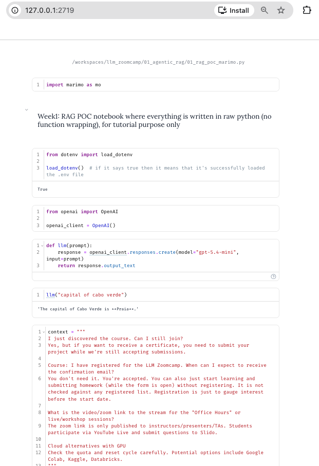

### Week 1 Notebooks 

* `01_rag_poc.ipynb`: RAG tutorial notebook where everything is written as it is
* `01_rag_poc_marimo.py`: Same POC, converted to a marimo notebook (`uv run marimo edit 01_rag_poc_marimo.py`)

<table>
  <tr>
    <td></td>
  </tr>

  </tr>
</table>

* `02_rag_cleaned.ipynb`: RAG POC notebook where the functions are split out, e.g. `ingest.py` 
* `03_persistent_rag_ingestion.ipynb`: Replaces in-memory knowledge base (KB) with persistent KB (sqlite)
* `04_rag_cleaned_with_persistent_knowledge_base.ipynb`: RAG POC notebook that uses persistent KB index