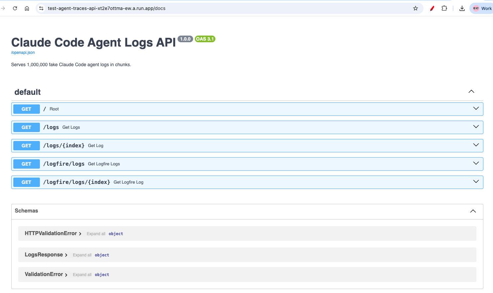
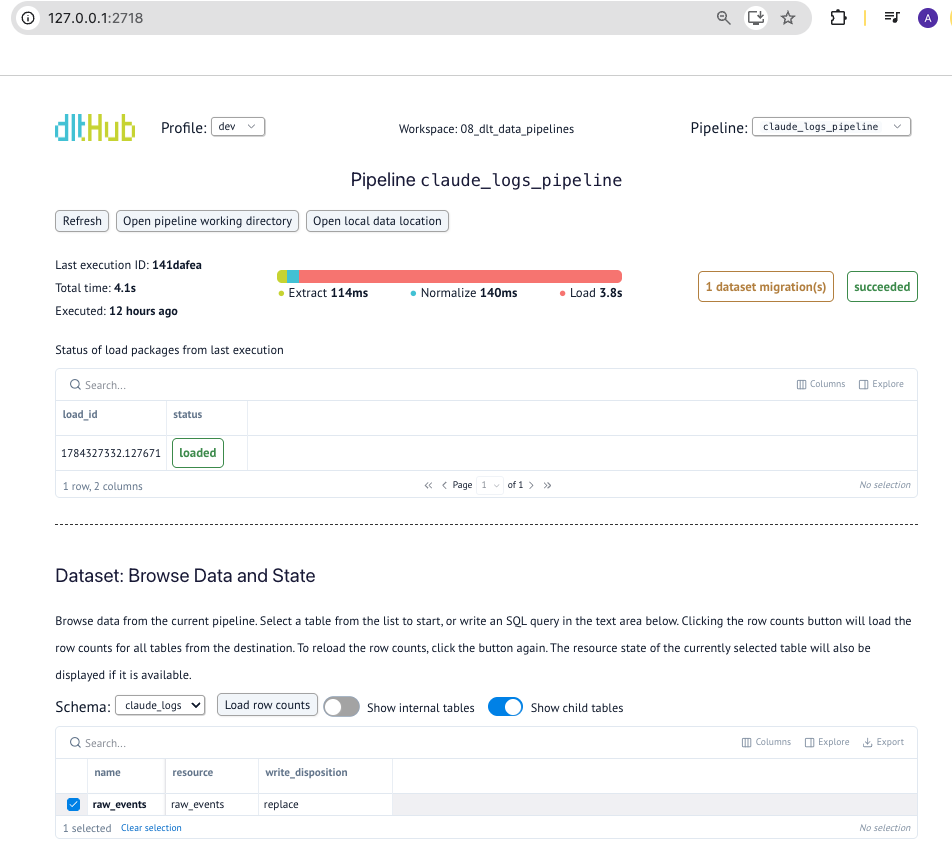
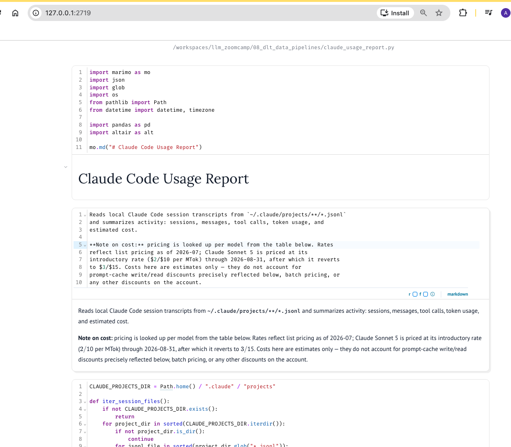
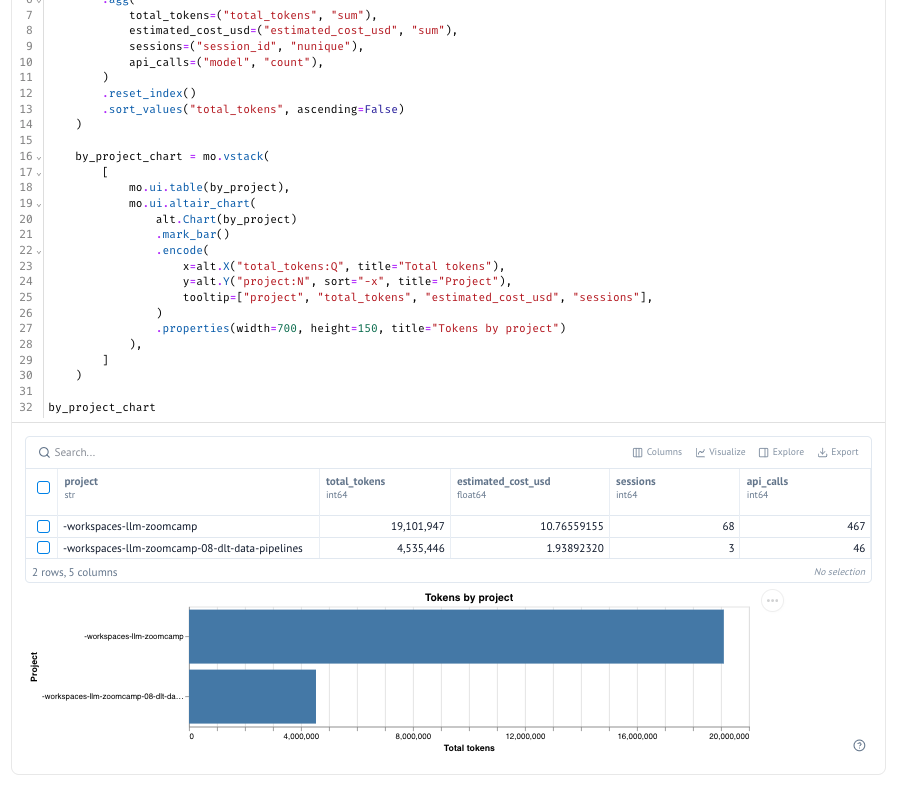
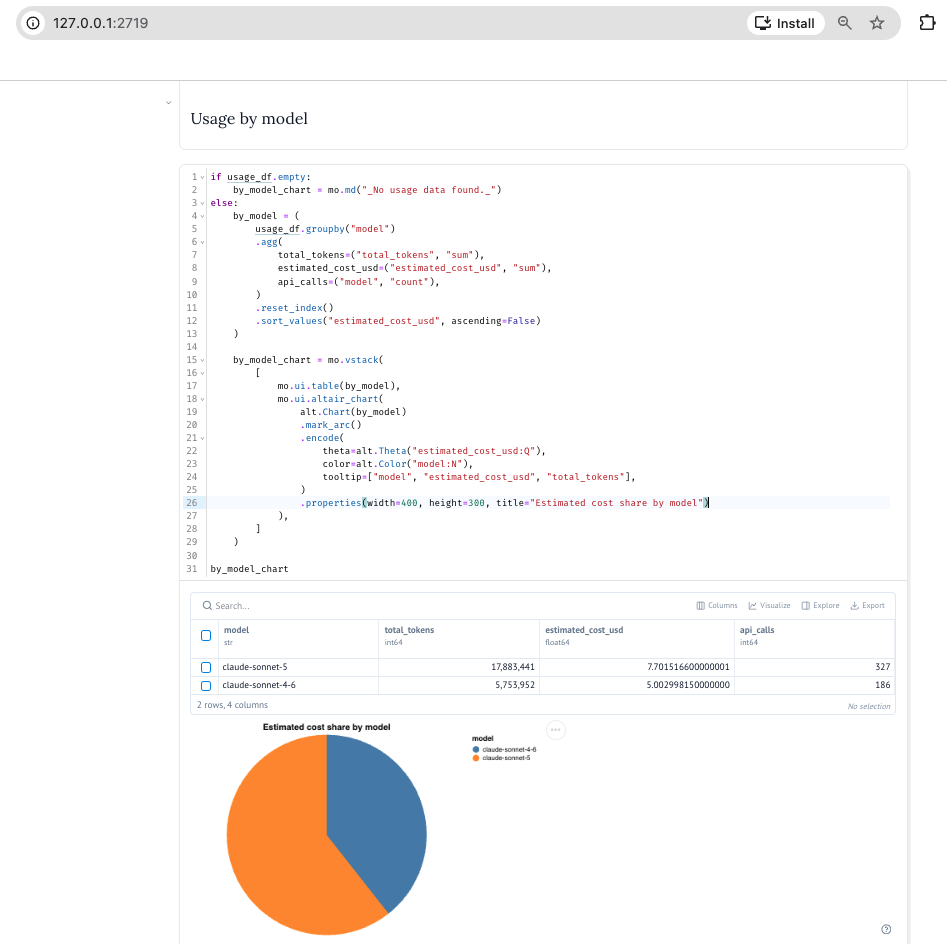
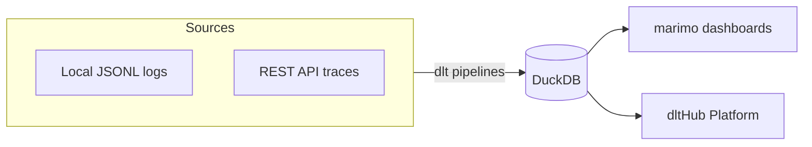

## Week8 workshop: Use dlt to pull traces from Claude (both locally and from a fake API that mimics Anthropic API), and display in a dashboard

<table>
<tr>
    <td align="center"></td>
    
  </tr>
  <tr>
  <td align="center"> [fake API that mimics anthropic API: https://test-agent-traces-api-xt2e7ottma-ew.a.run.app](https://test-agent-traces-api-xt2e7ottma-ew.a.run.app/docs) </td>
  </tr>
</table>


<table>
  <tr>
    <td align="center"></td>
    <td align="center"></td>
  </tr>
  <tr>
    <td align="center">dltHub pipeline dashboard showing the run status, timings, and loaded dataset for <code>claude_logs_pipeline</code></td>
    <td align="center">marimo notebook that loads local Claude Code logs and summarizes sessions, tokens, and estimated cost</td>
  </tr>
  <tr>
    <td align="center"></td>
    <td align="center"></td>
  </tr>
  <tr>
    <td align="center">Tokens and estimated cost broken down by project</td>
    <td align="center">Estimated cost share broken down by model</td>
  </tr>
</table>

* build data pipelines, dashboards and a scheduled cloud deployment driven by natural language prompts
* Tools
    * dltHub AI workbench (dlt + toolkits + MCP)
    * dltHub Platform
    * DuckDB
    * marimo [`claude_usage_report.py`](claude_usage_report.py)

---

#### What this app does

Every time we use a coding agent like Claude Code, Codex, or Copilot,it stores metadata about every session on your laptop. The logs live in places like `~/.claude/projects/` as JSONL files, one JSON object per line. They contain usage data, token counts, model names, tool calls - valuable data trapped in an awkward nested format.

This project turns those logs into structured tables and dashboards, using `dlt` and the `dltHub AI workbench`, which lets a coding agent build pipelines from natural-language prompts.

It includes:

1. A `dlt` pipeline loading local Claude Code logs into `DuckDB`.
2. A `marimo` dashboard over that data with activity, models, tokens, and projects.
3. A REST API pipeline pulling agent traces from a hosted API.
4. A scheduled deployment on the dltHub Platform with a shareable dashboard.

The architecture looks like this:



#### Prerequisites

- Python 3.11 or later
- [uv](https://docs.astral.sh/uv/) package manager
- A coding agent: Claude Code, Codex, or Copilot
- A dltHub Platform account (free): [app.dlthub.com](https://app.dlthub.com/)
- Some local agent logs so `~/.claude/projects/` has JSONL files to load.

#### Setup
```bash
uvx dlthub-init@latest
```

build a dlt pipeline that reads the JSONL session transcripts from ~/.claude/projects/ and loads them into DuckDB. We don't write the code by hand. We tell the agent what to build, and it uses the dltHub AI workbench to write the pipeline.

Tell the agent(Claude/Codex/Gemini) to build a dlt pipeline for the local logs:

> build a dlt pipeline, load data from local Claude logs as raw JSONs into DuckDB

The agent starts with the dltHub router skill, which figures out that the data lives in files on disk. It installs the filesystem-pipeline toolkit on demand - this toolkit didn't exist in the project when you
started. The router pulls it in based on the data source.

The toolkit walks the agent through the standard workflow:

- confirm the plan
- scaffold the pipeline
- configure credentials
- run it

<table>
  <tr>
    <td align="center"></td>
  </tr>
  <tr>
</table>

Run the dlt marimo dashboard:
```bash
uv run dlthub local show
```

<table>
  <tr>
    <td align="center"></td>
  </tr>
  <tr>
</table>

Run the marimo dashboard:
```bash
uv run marimo edit claude_usage_report.py 
```


Pull tracing logs from Logfire/Langfuse/DataDog/Anthropic API, load it into a database so that we can analyse it. dlt handles the data normalisation.  
```bash
build a dlt pipeline for https://test-agent-traces-api-xt2e7ottma-ew.a.run.app/docs, for /logs endpoint, load 20k logs into DuckDB, and build a similar marimo report


```