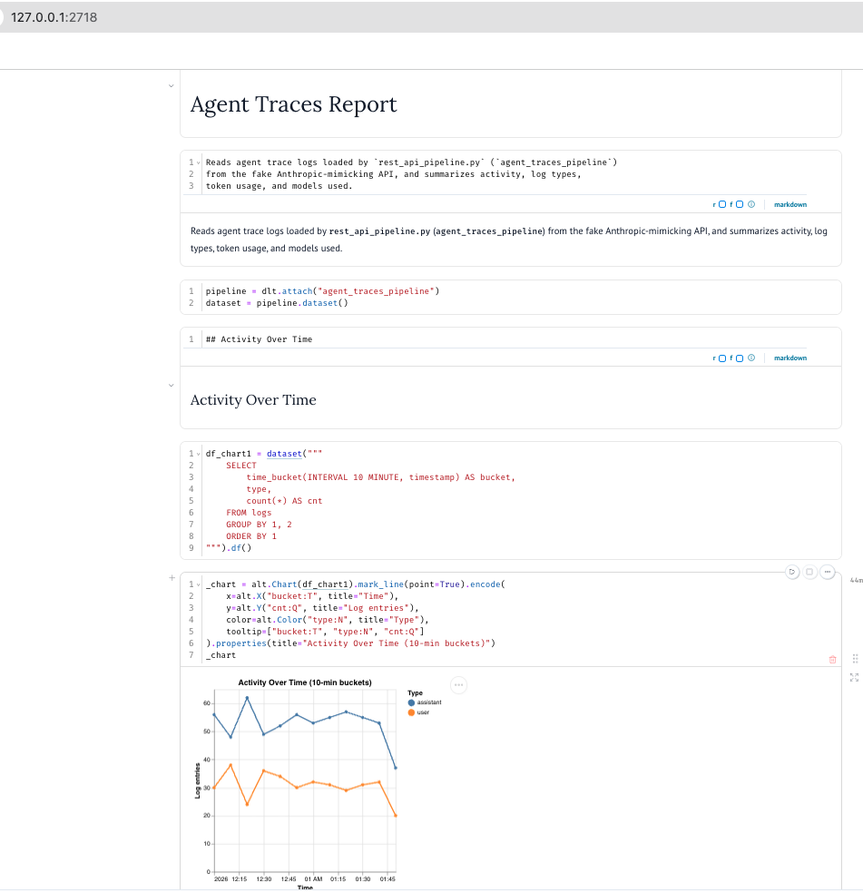

# Analysis Plan: agent_traces_pipeline

## Connection
* pipeline: agent_traces_pipeline
* dataset: agent_traces
* destination: duckdb

* 

## Profile Summary
| table | rows | key columns | notes |
|-------|------|-------------|-------|
| logs | 1000 | uuid, session_id, type, timestamp, message (json), usage__input_tokens, usage__output_tokens | temporal: timestamp (spans ~2h on 2026-01-01); type: user (367) / assistant (633); model is nested inside `message` JSON (assistant rows only) |

## Questions
1. [x] How does log activity vary over time, by type? → Chart 1
2. [x] What's the breakdown of log entries by type (user vs assistant)? → Chart 2
3. [x] How does token usage (input/output) trend over time? → Chart 3
4. [x] Which models are used, and how often? → Chart 4

## Data Gaps
(none)

## Chart 1: Activity Over Time
question: How does log activity vary over time, by type?
type: line
x: timestamp (10-min bucket)
y: count(*)
source: logs

```sql
SELECT
    time_bucket(INTERVAL 10 MINUTE, timestamp) AS bucket,
    type,
    count(*) AS cnt
FROM logs
GROUP BY 1, 2
ORDER BY 1
```

```altair
alt.Chart(df).mark_line(point=True).encode(
    x=alt.X("bucket:T", title="Time"),
    y=alt.Y("cnt:Q", title="Log entries"),
    color=alt.Color("type:N", title="Type"),
    tooltip=["bucket:T", "type:N", "cnt:Q"]
).properties(title="Activity Over Time (10-min buckets)")
```

## Chart 2: Log Type Breakdown
question: What's the breakdown of log entries by type (user vs assistant)?
type: bar
x: type
y: count(*)
source: logs

```sql
SELECT
    type,
    count(*) AS cnt
FROM logs
GROUP BY 1
ORDER BY 2 DESC
```

```altair
alt.Chart(df).mark_bar().encode(
    x=alt.X("type:N", title="Type", sort="-y"),
    y=alt.Y("cnt:Q", title="Log entries"),
    tooltip=["type:N", "cnt:Q"]
).properties(title="Log Entries by Type")
```

## Chart 3: Token Usage Over Time
question: How does token usage (input/output) trend over time?
type: line
x: timestamp (10-min bucket)
y: sum(usage__input_tokens), sum(usage__output_tokens)
source: logs (type='assistant')

```sql
SELECT
    time_bucket(INTERVAL 10 MINUTE, timestamp) AS bucket,
    sum(usage__input_tokens) AS input_tokens,
    sum(usage__output_tokens) AS output_tokens
FROM logs
WHERE type = 'assistant'
GROUP BY 1
ORDER BY 1
```

```altair
df_long = df.melt(id_vars=["bucket"], value_vars=["input_tokens", "output_tokens"],
                   var_name="token_type", value_name="tokens")
alt.Chart(df_long).mark_line(point=True).encode(
    x=alt.X("bucket:T", title="Time"),
    y=alt.Y("tokens:Q", title="Tokens"),
    color=alt.Color("token_type:N", title="Token type"),
    tooltip=["bucket:T", "token_type:N", "tokens:Q"]
).properties(title="Token Usage Over Time")
```

## Chart 4: Models Used
question: Which models are used, and how often?
type: bar
x: model
y: count(*)
source: logs (type='assistant')

```sql
SELECT
    json_extract_string(message, '$.model') AS model,
    count(*) AS cnt
FROM logs
WHERE type = 'assistant'
GROUP BY 1
ORDER BY 2 DESC
```

```altair
alt.Chart(df).mark_bar().encode(
    x=alt.X("model:N", title="Model", sort="-y"),
    y=alt.Y("cnt:Q", title="Assistant messages"),
    tooltip=["model:N", "cnt:Q"]
).properties(title="Assistant Messages by Model")
```
