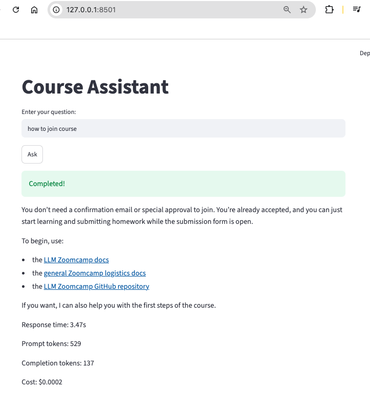
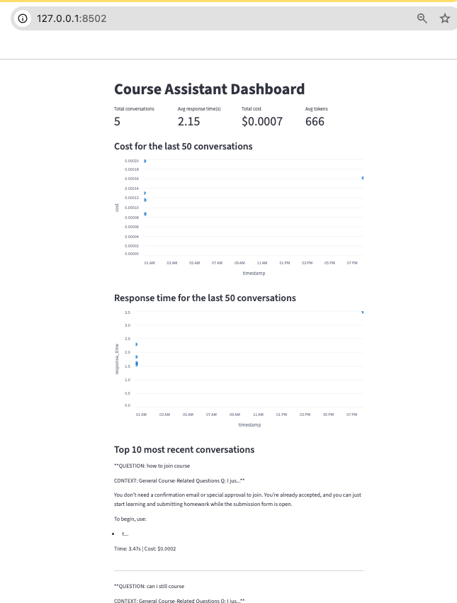
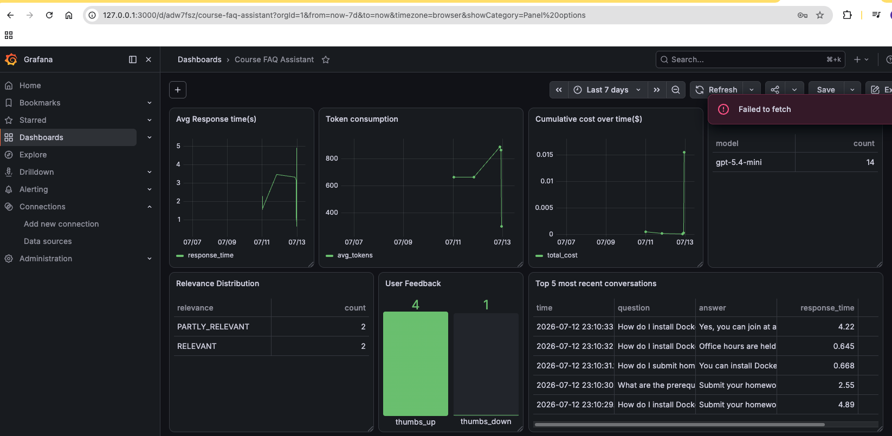

# llm_zoomcamp
2026 cohort of the [LLM Zoomcamp ran by DataTalksClub](https://github.com/DataTalksClub/llm-zoomcamp/tree/main)

<table>
  <tr>
    <td width="270"></td>
    <td width="215"></td>
  </tr>
  <tr>
    <td width="300">Chat interface</td>
    <td width="300">Streamlit dashboard for the logs</td>
  </tr>
  <tr>
    <td colspan="2" align="center"></td>
  </tr>
  <tr>
    <td colspan="2" align="center">Grafana monitoring dashboard, tracks response time, cost, tokens, and which models we use. </td>
  </tr>
</table>


## Week 1: Agentic RAG
* persistent knowledge base (`sqlite`) & indexing 
* agentic RAG
    * function calling
    * agentic loops

## Week 2: vector search with `pgvector`
* using `sentence_transformers` and `onnx` models

## Week 3: Workflow orchestration with Kestra

## Week 4: Evaluation
* Search eval: does the search return the right docs?
  - 1. Hit Rate
  - 2. MRR (Mean Reciprocal Rank)
* RAG eval: does the LLM generate good answers?
  * LLM-as-a-judge
* Agent eval: does the agent user tools efficiently?
  - 1. Final answer
  - 2. tool-recall trajectory

## Week 5: Monitoring
* Build a streamlit app to:
    * Chat with LLM - `make chat` 
    * Visualise the data we're collecting - `make dashboard`
* Use python to create a PostgreDB and the logs in a Postgres DB, which is then fed to Grafana
* Collect user feedbacks & use LLM-as-a-judge for relevancy - `judge.py`
* Create synthetic data to show what the streamlit dashboard would look like based on those stored in Postgre - `generate_synthetic_data.py`
* Display dashboard in grafana
* See `Makefile` for shortcuts

## Setup 
```
pip install uv
uv sync 
```

## Homeworks 
* [Answer to Homeworks](https://courses.datatalks.club/llm-zoomcamp-2026/)


TODO
1. create ground data for askmii for search eval (week 4)
2. create a dataset of docs retrieved for a convo in askmii
3. implement LLM-as-a-judge for Askmii